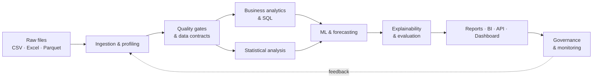
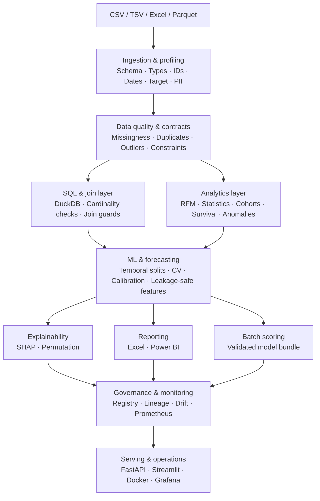

# 🚀 Customer Revenue & Churn Intelligence Platform

<p align="center">
  <strong>From raw tabular data to defensible business decisions.</strong><br>
  Business Analytics · BI · Statistics · Machine Learning · Forecasting · Explainability · Governance
</p>

<p align="center">
  
  
  
  
  
  
</p>

<p align="center">
  <em>A reusable analytics workbench for turning messy tabular data into reproducible, testable, explainable and deployable business intelligence.</em>
</p>

---

## 🧭 At a glance

| 🧹 Prepare | 📊 Understand | 🤖 Predict | 🔎 Explain | 📦 Deliver | 🛡️ Govern |
|:---:|:---:|:---:|:---:|:---:|:---:|
| Ingest, profile and validate data | Customer, revenue, cohort and statistical analysis | Churn classification, regression and time-series forecasting | SHAP, permutation importance and error analysis | Excel, Power BI tables, API and Streamlit dashboard | Lineage, drift monitoring, model registry and guarded SQL |

> **The idea:** build the full analytical workflow—not just a notebook or a standalone churn model.

## 📚 Contents

- [Business questions](#-business-questions)
- [End-to-end workflow](#-the-end-to-end-workflow)
- [Platform architecture](#️-platform-architecture)
- [Core capabilities](#-core-capabilities)
- [AI analytics agent](#-optional-ai-analytics-agent)
- [Curated case studies](#-curated-case-studies)
- [Technology stack](#️-technology-stack)
- [Quick start](#-quick-start)
- [Run the dashboard, API and Docker stack](#-run-the-dashboard-api-and-docker-stack)
- [Repository structure](#-repository-structure)
- [Reported release audit](#-reported-release-audit)
- [Reproducibility and limitations](#-reproducibility-and-limitations)
- [Career relevance](#-career-relevance)
- [Documentation](#-documentation)
- [Project status](#-project-status--active-development)
- [Contact](#-contact)

---

## 💼 Business questions

| Business question | Capability | Decision it can support |
|---|---|---|
| Who are our highest-value customers? | Customer and revenue profiling | Prioritize valuable customer groups |
| Which segments are growing or declining? | Segmentation and trend analysis | Identify where to investigate or invest |
| Where is revenue concentrated? | Revenue and customer concentration | Understand dependency and concentration risk |
| Which customers show churn risk? | Churn modeling | Prioritize retention outreach for review |
| What factors are associated with churn? | Statistical analysis and ML | Identify predictive signals for investigation |
| Are observed differences credible? | Hypothesis testing and effect sizes | Distinguish signal from noisy differences |
| What may happen next? | Time-series forecasting | Support planning with uncertainty-aware estimates |
| Which observations are unusual? | Anomaly detection | Flag records or periods for investigation |
| Can predictions be explained? | SHAP and permutation importance | Communicate model behavior and limitations |
| Can the system be monitored after deployment? | Drift, metrics and governance | Detect changes that may require review |

*Analytical findings support decisions; they do not automatically prove causation or guarantee business outcomes.*

---

## 🔄 The end-to-end workflow

<table>
  <tr>
    <th align="center">01 · INGEST</th>
    <th align="center">02 · PROFILE</th>
    <th align="center">03 · VALIDATE</th>
    <th align="center">04 · ANALYZE</th>
    <th align="center">05 · MODEL</th>
    <th align="center">06 · EXPLAIN</th>
    <th align="center">07 · DELIVER</th>
    <th align="center">08 · MONITOR</th>
  </tr>
  <tr>
    <td align="center">CSV<br>Excel<br>Parquet</td>
    <td align="center">Schema<br>Types<br>IDs / dates</td>
    <td align="center">Nulls<br>Duplicates<br>Contracts</td>
    <td align="center">RFM<br>Revenue<br>Statistics</td>
    <td align="center">Churn<br>Regression<br>Forecasts</td>
    <td align="center">SHAP<br>Importance<br>Error analysis</td>
    <td align="center">Reports<br>BI tables<br>API / UI</td>
    <td align="center">Drift<br>Metrics<br>Lineage</td>
  </tr>
</table>



The same workflow supports data analysis, BI, statistical investigation, predictive modeling and production-oriented delivery across CSV, TSV, Excel and Parquet inputs.

---

## 🏗️ Platform architecture



### Architecture principles

- **Quality before conclusions:** profile data and apply explicit validation gates before analysis.
- **Leakage-aware modeling:** separate training and evaluation correctly, especially for time-dependent data.
- **Guarded joins and SQL:** validate join cardinality and reject unsafe query patterns.
- **Explainability with caveats:** show how a model behaves without claiming that feature importance proves causality.
- **Governed delivery:** retain run metadata, hashes and lineage where supported by the workflow.

---

## ⚡ Core capabilities

### 🧹 Data engineering & quality

- CSV, TSV, XLSX/XLS and Parquet ingestion
- Automatic schema and type inference
- Date, ID and target-candidate detection
- Missingness diagnostics and duplicate detection
- Cardinality analysis and outlier diagnostics
- Data-quality scoring and explicit data contracts
- Invalid-type and invalid-date checks
- Conservative multi-table join discovery
- Join-cardinality validation and join-explosion protection

### 📊 Business analytics

- Customer and revenue profiling
- RFM segmentation
- Retention and survival analysis
- Revenue and customer concentration
- Cohort-style analysis
- Anomaly detection
- Statistical group comparisons
- Executive summaries with explicit analytical caveats

### 📐 Statistical analysis

| Method | Use |
|---|---|
| Pearson, Spearman and Kendall correlation | Examine different forms of association |
| P-values and Benjamini–Hochberg FDR correction | Evaluate evidence while addressing multiple comparisons |
| Welch's t-test | Compare group means without assuming equal variances |
| Cohen's *d* | Quantify standardized effect size |
| Bootstrap confidence intervals | Estimate uncertainty using resampling |
| Normality diagnostics | Check assumptions relevant to selected methods |

> **Interpretation rule:** association is not causation. Statistical significance alone does not establish business importance.

### 🤖 Machine learning

<table>
  <tr><th>Problem types</th><th>Validation safeguards</th><th>Evaluation</th></tr>
  <tr>
    <td>Binary classification<br>Multiclass classification<br>Regression</td>
    <td>Cross-validation<br>Chronological validation<br>Leakage-safe preprocessing<br>Rare-class safeguards<br>Final refitting<br>Artifact validation</td>
    <td>ROC-AUC · PR-AUC · F1<br>Balanced accuracy · Brier score<br>Calibration · Confusion matrix<br>MAE · RMSE · R²<br>Threshold optimization<br>Decision-curve / net-benefit analysis</td>
  </tr>
</table>

### 🔍 Explainability

- SHAP-based explanations
- Permutation feature importance
- Individual-observation explanations
- Feature-level interpretation
- Predictive association analysis

> Model explainability describes model behavior; it does **not** establish causality.

### 📈 Time-series & forecasting

| 🔬 Diagnose | 🧰 Engineer | 📉 Forecast & validate |
|---|---|---|
| Timestamp normalization; duplicate timestamp handling; frequency and spacing diagnostics; regular vs. irregular series; rolling statistics; ADF and KPSS tests; differencing; ACF/PACF; Ljung–Box; Jarque–Bera; spectral analysis; decomposition; trend and seasonal strength | Calendar and Fourier features; lag features; leakage-safe rolling features | Naive, drift and seasonal-naive baselines; ETS; ARIMA; leakage-aware lag/Ridge forecasting; expanding-window backtesting; recursive multi-step forecasts |

### 🛡️ Governance, monitoring & security controls

<table>
  <tr><th>Model governance</th><th>Monitoring</th><th>Security and execution controls</th></tr>
  <tr>
    <td>Model registry<br>Immutable model hashes<br>Champion/challenger workflow<br>Experiment tracking<br>Model cards<br>Dataset and model lineage</td>
    <td>Data-drift monitoring<br>Prometheus metrics<br>Grafana dashboards</td>
    <td>Read-only SQL validation<br>Reject destructive or multi-statement SQL<br>Reject SQL comments and unsafe administrative commands<br>Upload-size enforcement<br>Constant-time API-key comparison<br>Reject malformed AI-agent responses<br>Data-quality gates<br>Join-explosion protection</td>
  </tr>
</table>

### 📊 BI delivery

- Excel reports
- Power BI fact tables and dimension tables
- Date tables and relationship metadata
- DAX measures
- Power BI import instructions

---

## 🧠 Optional AI analytics agent

The optional provider-neutral analytics agent is designed around an **OpenAI-compatible interface**.

<table>
  <tr>
    <th align="center">01 · ASK</th><th align="center">02 · PLAN</th><th align="center">03 · VALIDATE</th><th align="center">04 · QUERY</th><th align="center">05 · EXPLAIN</th>
  </tr>
  <tr>
    <td align="center">Natural-language question</td><td align="center">Query plan</td><td align="center">Schema checks and guarded SQL</td><td align="center">Read-only execution</td><td align="center">Result analysis and business explanation</td>
  </tr>
</table>

The system validates model output instead of silently accepting malformed or fabricated responses. AI-generated output should still be reviewed, and the SQL guardrails should be assessed in the context of the intended deployment.

---

## 🧪 Curated case studies

<details>
<summary><strong>Case study 1 · IBM Telco Customer Churn</strong></summary>

Approximately 7K customers. The workflow demonstrates:

- Customer profiling and churn analysis
- Segmentation
- Predictive modeling
- Explainability
- Business interpretation

</details>

<details>
<summary><strong>Case study 2 · UCI Online Retail II</strong></summary>

A large transactional retail dataset containing more than one million transactions. The workflow constructs customer-level snapshots and future-looking churn targets while avoiding future transactions as predictors.

> Benchmark metrics are not hard-coded as fabricated results. Run the pipelines in your environment to generate current metrics.

</details>

---

## 🧰 Technology stack

| Layer | Technology |
|---|---|
| Language | Python 3.10+ |
| Data processing | Pandas, NumPy |
| SQL | DuckDB / SQL |
| Statistics | SciPy / statistical tooling |
| Machine learning | Scikit-learn |
| Explainability | SHAP |
| Dashboard | Streamlit |
| API | FastAPI |
| BI outputs | Excel / Power BI |
| Monitoring | Prometheus / Grafana |
| Deployment | Docker Compose |
| Testing | Pytest |
| Version control | Git / GitHub |

---

## 🚀 Quick start

### 1. Clone the repository

```bash
git clone https://github.com/shubham-k-jha/Customer-Revenue-Churn.git
cd Customer-Revenue-Churn
```

### 2. Create and activate a virtual environment

**Linux / macOS**

```bash
python -m venv .venv
source .venv/bin/activate
```

**Windows PowerShell**

```powershell
python -m venv .venv
.venv\Scripts\Activate.ps1
```

### 3. Install dependencies

```bash
pip install -r requirements.txt
```

---

## ✅ Verify the installation

Run these documented checks from the repository root:

| Check | Command |
|---|---|
| Smoke test | `python scripts/smoke_test.py` |
| Test suite | `pytest -q` |
| Release validation | `python scripts/validate_release.py` |
| Performance benchmark | `python scripts/benchmark.py --rows 10000 100000 1000000` |

These commands are reproduced from the supplied project README; verify their availability in the current checkout before relying on them.

---

## 🖥️ Run the dashboard, API and Docker stack

### Streamlit dashboard

```bash
streamlit run app/streamlit_app.py
```

Open the local URL printed in the terminal.

### FastAPI service

In another terminal:

```bash
uvicorn api.main:app --host 0.0.0.0 --port 8000
```

| Endpoint | Purpose |
|---|---|
| `http://localhost:8000/health` | Health check |
| `http://localhost:8000/metrics` | Metrics endpoint |

### Docker Compose

| Service | Purpose |
|---|---|
| `api` | FastAPI analytics/model-serving API |
| `dashboard` | Streamlit analytics dashboard |
| `prometheus` | Metrics collection |
| `grafana` | Monitoring dashboards |

Start the stack with:

```bash
docker compose up --build
```

> **Deployment note:** the supplied audit says Docker Compose configuration was structurally parsed, but Docker was not live-launched because a Docker daemon was unavailable in the audit environment. Validate the containers in your own deployment environment.

---

## 📁 Repository structure

```text
Customer-Revenue-Churn/
├── api/                    # FastAPI application
├── app/                    # Streamlit dashboard
├── configs/                # Platform and model policies
├── data/samples/           # Reproducible demo datasets
├── docker/                 # Container and monitoring configuration
├── docs/                   # Architecture, methodology and operations
├── models/                 # Model artifact location
├── reports/                # Generated reports
├── scripts/                # Smoke, benchmark and release validation
├── sql/                    # Business and retail SQL
├── src/                    # Core platform implementation
├── tests/                  # Unit and integration tests
├── Makefile                # Common engineering commands
├── pyproject.toml          # Package configuration
├── requirements.txt        # Dependencies
└── docker-compose.yml      # Local service stack
```

*This tree reflects the structure described in the supplied README. Confirm it against the current repository if files have changed.*

---

## 🧪 Reported release audit

The supplied README reports an offline audit of the packaged release, extracted into a fresh directory. The results below are **reported audit results, not a new audit performed while editing this README**.

| Audit check | Reported result |
|---|---|
| Test suite | ✅ 67 passed |
| Optional Parquet test | ⚠️ 1 skipped |
| Smoke test | ✅ Passed |
| 10K benchmark | ✅ Passed |
| 100K benchmark | ✅ Passed |
| 1M benchmark | ✅ Passed |
| Python compilation | ✅ Passed |
| Wheel build | ✅ Passed |
| Release artifact scan | ✅ Passed |
| ZIP integrity | ✅ Passed |
| Docker Compose parsing | ✅ Passed |
| Version consistency | ✅ Passed |
| Python cache/build artifacts in release archive | ✅ Reported absent |

---

## 🔬 Reproducibility and limitations

### Reproducibility support

- Deterministic random seeds
- Dataset hashes
- Git commit metadata
- Python and platform metadata
- Model artifact hashes
- Run metadata
- Release manifests

The supplied documentation describes bounded dependency versions. A complete resolved lockfile should be generated in a connected environment or CI using the project's dependency-locking procedure.

### Important limitations

This is an analytics application, **not a security-certified production system**. Before exposing it publicly or using it inside an organization, complete appropriate:

- Threat modeling and secrets management
- Authentication and authorization review
- Network controls and deployment hardening
- Security review and penetration testing
- Domain-specific validation and monitoring design

Automated analytics does not guarantee valid business conclusions. Data quality, domain knowledge, causal design, evaluation design and deployment context remain critical.

---

## 🎯 Why this project matters

This project is intended to demonstrate a complete analytics lifecycle rather than a single notebook:

| Stage | Evidence of the capability |
|---|---|
| Data engineering | Reusable ingestion, profiling and quality checks |
| Business analysis | Customer, revenue, retention and concentration analysis |
| Statistical reasoning | Hypothesis tests, effect sizes and uncertainty estimates |
| Machine learning | Validation, calibration, metrics and model artifacts |
| Explainability | SHAP and permutation importance workflows |
| Forecasting | Time-series diagnostics and backtesting approaches |
| Reporting | Excel and BI-ready data outputs |
| Serving | API and dashboard entry points |
| Governance | Registry, hashes and lineage support |
| Monitoring | Drift and operational metrics integrations |

> **Project summary:** I built a governed analytics platform that takes raw tabular data from ingestion through business analysis, predictive modeling, explainability, reporting, serving and monitoring.

---

## 💼 Career relevance

| Role | Horizontal workflow | Skills demonstrated |
|---|---|---|
| **Business Analyst** | Requirements → Business questions → KPI definitions → SQL → Statistical reasoning → Recommendations → Stakeholder reporting | Problem framing, metrics, evidence-based recommendations |
| **Data Analyst** | Data cleaning → EDA → Data quality → SQL / Pandas → Statistics → Visualization → Business conclusions | Data wrangling, analysis, communication |
| **BI Analyst** | Data model → Fact / dimension tables → Relationships → DAX → Power BI outputs → Executive monitoring | Data modeling, semantic reporting, dashboard delivery |
| **Data Scientist** | Feature engineering → Validation → Model selection → Calibration → Explainability → Error analysis → Deployment → Monitoring | Predictive modeling and model evaluation |
| **Analytics Engineer** | Reusable pipelines → Data contracts → SQL → Testing → Reproducibility → Lineage → Governed outputs | Reliable analytical data systems |

---

## 📚 Documentation

Recommended reading order:

1. **[Project Guide](docs/PROJECT_GUIDE.md)** — complete project explanation
2. **[Architecture](docs/architecture.md)** — technical architecture
3. **[Methodology](docs/methodology.md)** — analytical methodology
4. **[Business Case](docs/business_case.md)** — business framing
5. **[Model Card](docs/model_card.md)** — model governance
6. **[Operations Runbook](docs/operations_runbook.md)** — operations
7. **[Security](docs/security.md)** — security controls
8. **[Interview Story](docs/interview_story.md)** — interview preparation

---

## 🚧 Project status & active development

**Status:** 🟢 Working · 🧪 Actively tested · 🚧 Continuously improving

The project is described as working and actively maintained, but it is **not considered finished**. Development priorities include:

| 🔧 Reliability | 📈 Analytics | 🤖 Intelligence | 🛡️ Operations | 🎨 Experience |
|---|---|---|---|---|
| Expand tests and edge-case handling; improve validation | Add business analytics; expand forecasting and time-series features | Improve AI agent, ML diagnostics and explainability | Strengthen governance, drift monitoring, lineage and containerization | Improve dashboard usability, examples and documentation |

The aim is to improve reliability, accuracy, performance, explainability, usability and production readiness—not simply to increase the number of features.

---

## 📌 License

See [`LICENSE`](LICENSE).

---

## 🤝 Contact

<p align="center">
  <strong>Shubham Kumar Jha</strong><br>
  Data Analytics · Business Analytics · Data Science
</p>

<p align="center">
  <a href="mailto:shubhamkjha.ds@gmail.com"></a>
  <a href="https://github.com/shubham-k-jha"></a>
  <a href="https://www.linkedin.com/in/shubham-k-jha/"></a>
</p>

<p align="center">
  <strong>Built to demonstrate that analytics can be reproducible, testable, explainable and deployable—not merely visually impressive.</strong><br>
  <sub><a href="#-contents">Back to top ↑</a></sub>
</p>
