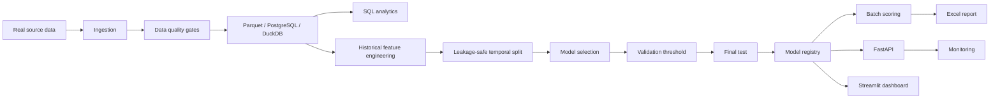

# Architecture

```mermaid
flowchart LR
A[Real source data] --> B[Ingestion]
B --> C[Data quality gates]
C --> D[Parquet / PostgreSQL / DuckDB]
D --> E[SQL analytics]
D --> F[Historical feature engineering]
F --> G[Leakage-safe temporal split]
G --> H[Model selection]
H --> I[Validation threshold]
I --> J[Final test]
J --> K[Model registry]
K --> L[Batch scoring]
K --> M[FastAPI]
L --> N[Excel report]
M --> O[Monitoring]
K --> P[Streamlit dashboard]
```
